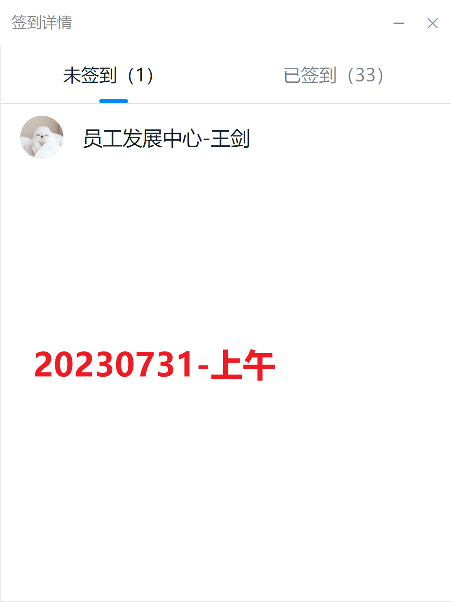
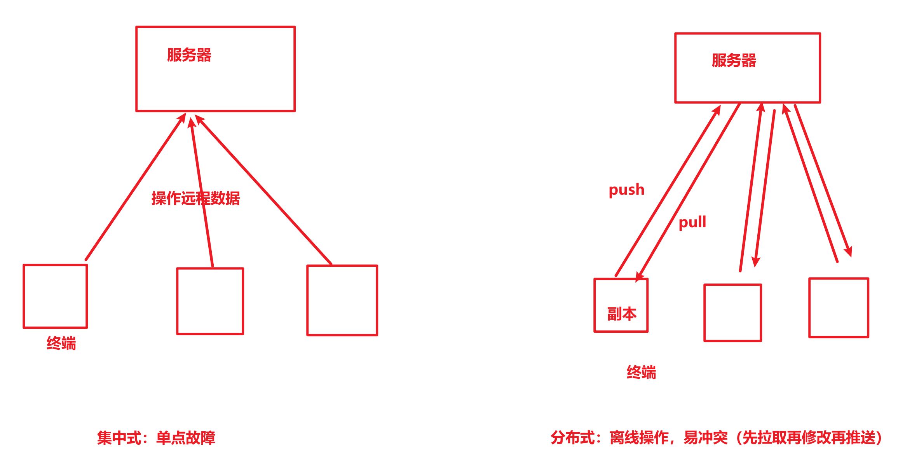
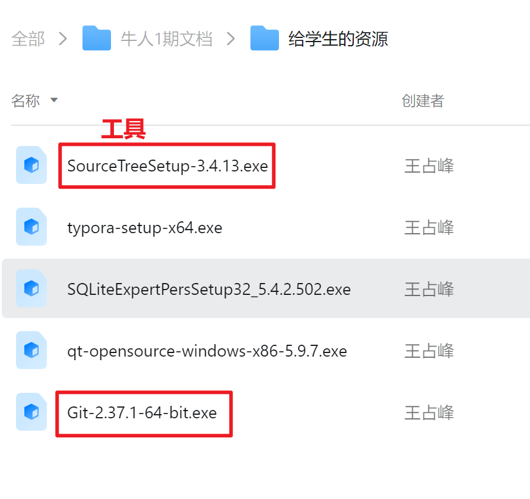
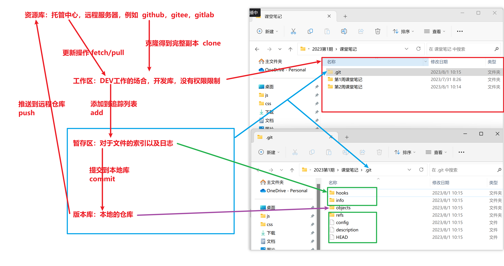
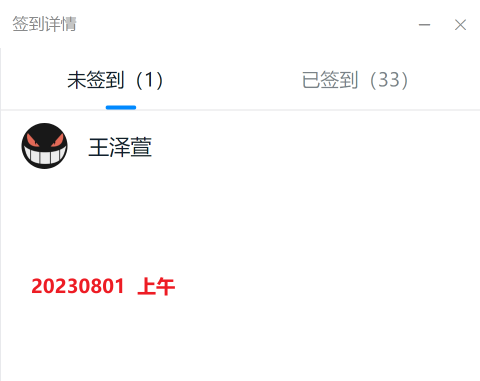

课程：

技术【C，面向结构，C++，面向对象，Qt】

辅助：

项目：


# 项目启动会

介绍项目

概要描述

运作方式

考核方式


## 1	什么是项目

a	上课学习内容		【不是】

b	活动答辩				【是】

我打算购买一辆新能源汽车跑滴滴。【前序阶段是**项目**， 后序阶段是**运营**（重复为了持续）】

项目是为了得到某种产品、成果、服务 而付出的临时的一次性努力

### 1.1	项目的特点：

​	a	临时性，有开始时间和结束时间，  项目是追求结束的

​	b	独特性，没有完全相同的两个项目，意味着其他项目的资料只能借鉴，不能直接复用。

​	c	渐进明细性：随着项目推进细节部分更加细化，符合波动式计划原则


## 2	如何做好项目管理

a	熟悉项目管理的相关知识【图示技术，分析技术】

b	良好的沟通和协调能力【主动，扫清沟通障碍（语义、认知）】

c	应用领域的知识、标准和规定【不同的项目深入了解其背景】

d	按照管理流程实施【项目管理的各个环节都是可以概略的或者可裁剪的，Plan Do CheckAction】


本项目着重体现四个方面：   需求，设计，编码规范，测试

## 3	项目概述

完成       智能家居系统 的2个子部分【服务器+控制中心】

服务器：  linux下c实现（不限定必须是socket）

控制中心：Qt结合C++实现（通用智能家居控制中心基本功能，包括但不限定于   灯光，温度，窗帘，监控）

# 

## 4	运作方式

PDCA推进流程，

尽量能够提前实现【设计和编码】


## 5	考核方式

过程（需求15%+设计30%+代码30%+测试25%）   ，   答辩（演示，答辩）


# 需求

重要程度： 由需求抽象出范围（范围说明书，WBS，WBS字典）， 指导项目后续开发的基础

需求划分：按阶段划分为

​	a	用户高层需求：一个idea，一个描述，一个期望，通常表现在【招投标文件】

​	b	产品需求：功能，架构  ，  通常表现在 【SOW】

​	c	开发需求：功能细节，非功能，设计约束，通常表现【需求规格说明书】


## 需求的描述

### 1	尽量使用自然语言描述，减少歧义的产生

使用该系统必须先登录，打开软件时，首先进入登录页面，自动将输入光标聚焦在用户名输入框，输入正确的用户名以及对应的密码，点击登录按钮进入系统，用户名和密码不对应则显示出错提示信息。

### 2	适当时可以采用数学方法描述或者  正则表达式的方式描述

用户名的格式需要符合规范

​	数学描述：（6，8】   

​	数据字典： 1-9 + a-z + ！- ^       或    {(1-9)}7

​	正则表达式：  "^[0-9a-zA-Z!-^]{6,8}$"   

### 3	描述时可以采用模板方式

结合  《需求跟踪矩阵》   描述需求， 当前需要完成任务， 结合  《项目文档》说明，  课堂笔记  ， 编写  《需求跟踪矩阵》  ，     在评审截止前提交【8月1日的 11点之前】， 命名规范        姓名 _ 项目名称 _ 需求跟踪矩阵(RTM).xlsx 


# 学员任务：   【1V1指导方式】

可以文字提问或者   语音连线

如果没有提问者， 对历史文件进行评审，需要点名同学连麦  


# 当前： 需求分析文档制作


# 





# 文档与配置管理

需求--》范围--》.........配置

产品配置是指一个产品在其生命周期各个阶段所产生的各种形式的和各种版本的文档、计算机程序、部件、数据。

对于产品配置：权限管控，日志记录，保留所有的历史版本。

配置管理的参与人员：PM项目经理根据CCB批准的配置管理进行管控，CMO配置管理员负责执行和向CCB报告，DEV开发人员参与过程，SIO系统集成员负责发布版本。

配置项：描述一个事物的属性（名称、标识符、文件状态、版本、作者、日期）

配置库： 一组受控制的、辅助软件开发、使用和维护的软件相关说明

​	1	开发库（动态库）：开发人员个人专用,进行控制内容（没有权限控制）

​	2	受控库（主库）：某个阶段的产物（有权限控制），DEV只读，CMO读写。

​	3	产品库：完成测试后的最终产品。


可以使用版本号进行区分：

内部版本和外部版本：内部版本一般称为构造基线，例如NT6.1   ，外部版本一般称为发行基线，例如windows7

通用版本规则X.Y.Z:

​	X	主版本	架构

​	Y	次版本	功能

​	Z	修改状态	有Z代表不稳定

1.0	通常代表第一个正式发布的版本，    0.8	通常代表 草稿   


借助配置管理工具实现自动管理

# git	

开源，分布式配置管理工具






## 如何使用git

在 工作区  右键鼠标   选择   “git  bash  here”   即可




如何推送到远程仓库：

1	选择远程仓库并且注册账号

2	本地生成ssh密钥对， 设置远程仓库的密钥

3	创建远程仓库

```
第一次使用远程仓库内容，   git  clone   仓库地址即可
```




